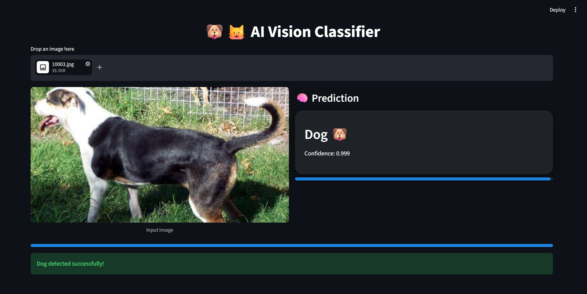

# 🐶🐱 Cats vs Dogs Classifier (Deep Learning)

A deep learning web app that classifies images as either a **Cat 🐱 or Dog 🐶** using TensorFlow and Streamlit.

Built with transfer learning using MobileNetV2 for fast and accurate predictions.

---

## 🚀 Demo



---

## 🧠 Model Details
- Base Model: MobileNetV2 (ImageNet pretrained)
- Technique: Transfer Learning
- Input Size: 224x224
- Output: Binary Classification (Cat / Dog)

---

## ⚙️ Tech Stack
- Python 🐍
- TensorFlow / Keras 🤖
- Streamlit 🎈
- NumPy
- Pillow

---

## ✨ Features
- 📤 Image upload
- 🧠 Real-time prediction
- 📊 Confidence score
- 🌙 Dark UI
- 🧊 Glassmorphism design
- ⚡ Fast inference

---

## ▶️ How to Run

```bash
git clone https://github.com/7odam7amed/cats-vs-dogs-image-classifier
cd cats-vs-dogs
pip install -r requirements.txt
streamlit run "app/streamlit.py"
